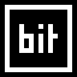

# 

A **bit**map font **ed**itor.

## Overview

**bited** is an open-source designer and editor for bitmap/pixel fonts --
specifically monochrome Unicode BDF fonts. It features a coterie of small yet
impactful quality-of-life goodies that aim to make the creative process smooth
and enjoyable for the type designer. Some of these features include:

- Simple, composable tools for drawing and manipulating glyphs.
- Font preview with text presets for testing fonts.
- Custom UI font made with bited.
- Light and dark mode.

bited is still undergoing heavy development; any bugs should be reported to
[Issues](https://github.com/molarmanful/bited/issues).

## Credits

bited is proudly built with:

- [Godot](https://godotengine.org/) + [godot-ci](https://github.com/aBARICHELLO/godot-ci)
- [SQLite](https://www.sqlite.org/) + [godot-sqlite](https://github.com/2shady4u/godot-sqlite)
- [UnifontEX](https://github.com/stgiga/UnifontEX)
- [MkDocs Material](https://squidfunk.github.io/mkdocs-material/) + [MkDocs Awesome Pages Plugin](https://github.com/lukasgeiter/mkdocs-awesome-pages-plugin)

Development of bited would not have been possible without the following
inspirations and resources:

- Software
  - [Bits'n'Picas](https://github.com/kreativekorp/bitsnpicas)
  - [gbdfed](https://github.com/andrewshadura/gbdfed)
  - [FontForge](https://fontforge.org)
  - [Pixelorama](https://github.com/Orama-Interactive/Pixelorama)
  - [FreeType BDF drivers](https://github.com/ImageMagick/freetype/tree/main/src/bdf)
- Font Testers
  - [Cyreal Font Testing Pages](https://www.cyreal.org/Font-Testing-Page/)
  - [Greek Pangrams](https://backpacker.gr/pangrams/)
  - [Markus Kuhn UTF-8 Demo](https://www.cl.cam.ac.uk/~mgk25/ucs/examples/UTF-8-demo.txt)
- Specs
  - [BDF 2.1](https://www.x.org/docs/BDF/bdf.pdf)
  - [BDF 2.2](https://adobe-type-tools.github.io/font-tech-notes/pdfs/5005.BDF_Spec.pdf)
  - [XLFD](https://www.x.org/docs/XLFD/xlfd.pdf)
- Code Pages
  - [Unicode Consortium UCMs](https://github.com/unicode-org/icu/tree/main/icu4c/source/data/mappings)
  - [KreativeKorp Encodings References](https://www.kreativekorp.com/charset/encoding/)
