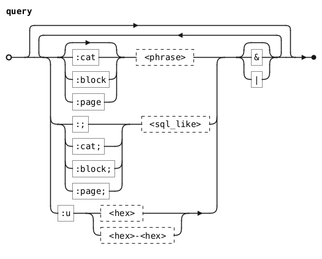

# Finder

The Finder (++ctrl+f++) allows you to create dynamic Tables by querying for
glyphs.

{loading=lazy}

/// caption

///

This is especially useful if, for example, you're looking for all instances of
the Python logo in Nerd Fonts. You can type in a query like `:cat nf & python`,
then copy your design across all the matched glyphs.

{loading=lazy}

/// caption

///

## Query Language

!!! warning

    The query language is experimental (a.k.a. scuffed and subject to change).

The Finder has a rudimentary query language that internally transpiles to a
SQLite statement. Queries evaluate from left to right.

### Phrases and SQL-LIKE

???+ question "`%` `_` Wildcards"

    - `%` matches zero or more of any character.
    - `_` matches one of any character.

    You can escape these with `\`, which treats them as normal characters.

By default, the transpiler wraps "phrases" with `%` -- i.e.
`column LIKE '%<phrase>%' ESCAPE '\'` in SQLite. But there are also keywords
followed by `;` that won't wrap their subsequent phrases. For example, `test`
and `:; %test%` are equivalent queries.

### `:cat`

Filters any matching Unicode character categories. Has a SQL-LIKE variant.

bited has a character category `NF` for Nerd Font characters. This isn't an
official Unicode category, but is nevertheless included for easy querying of
Nerd Fonts.

**Example**: `:cat cc`

### `:block`

Filters any matching Unicode blocks. Has a SQL-LIKE variant.

**Example**: `:cat latin`

### `:page`

Filters any matching bited codepages. Has a SQL-LIKE variant.

**Example**: `:page dyalog`

### `:u`

Filters any characters that match the specified hex codepoint or range of hex
codepoints. Individual hex codepoints can have `%` `_` wildcards.

**Example**: `:u 00A_`, `:u a0-ffff`

### `&` `|`

Logical AND and OR, respectively.

By default, the transpiler will join consecutive keyword sequences with AND --
e.g. `:block some words :page other words` and
`:block some words & :page other words` are equivalent queries. Explicitly
including `&` becomes necessary when you want to join a keyword sequence with a
separate phrase, like in `:block some words & a separate phrase`.
