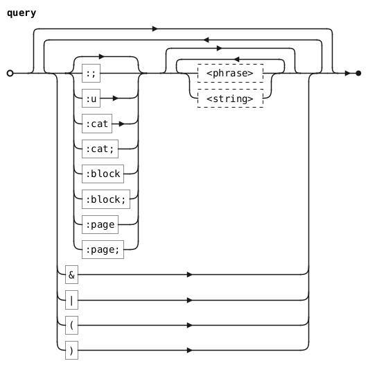

# Finder

The Finder (++ctrl+f++) allows you to create dynamic Tables by querying for
glyphs.

{loading=lazy}

/// caption

///

This is especially useful if, for example, you're looking for all instances of
the Python logo in Nerd Fonts. You can type in a query like `:cat nf & python`,
then copy your design across all the matched glyphs.

{loading=lazy}

/// caption

///

## Query Language

!!! warning

    The query language is experimental (a.k.a. scuffed and subject to change).

The Finder has a rudimentary query language that internally transpiles to a
SQLite statement.



### Phrases

???+ question "`%` `_` Wildcards"

    - `%` matches zero or more of any character.
    - `_` matches one of any character.

    You can escape these with `\`, which treats them as normal characters.

Phrases are one of the query language's search primitives. If a word in the
query isn't a special keyword, then it's a phrase.

The transpiler joins consecutive phrases with OR, so the query `just some words`
will return the combined results of `just`, `some`, and `words`.

### Strings

In addition to phrases, the query language also features strings, denoted by
wrapping with `"`. This is useful if you want to search using a term that would
otherwise get broken up by the transpiler. The transpiler treats the contents of
strings as one phrase; strings and phrases are interchangeable.

You can escape `"` and `\` inside strings with `\`.

### `;` and SQL-Like

By default, the transpiler wraps phrases and strings with `%` -- i.e.
`column LIKE '%<phrase>%' ESCAPE '\'` in SQLite. But there are also keywords
followed by `;` that won't wrap their subsequent phrases/strings. For example,
`test` and `:; %test%` are equivalent queries.

### `:cat`

Filters any matching Unicode character categories. Has a SQL-LIKE variant.

bited has a character category `NF` for Nerd Font characters. This isn't an
official Unicode category, but is nevertheless included for easy querying of
Nerd Fonts.

**Example**: `:cat cc`

### `:block`

Filters any matching Unicode blocks. Has a SQL-LIKE variant.

**Example**: `:cat latin`

### `:page`

Filters any matching bited codepages. Has a SQL-LIKE variant.

**Example**: `:page dyalog`

### `:u`

Filters any characters that match the specified hex codepoint or range of hex
codepoints. Individual hex codepoints can have `%` `_` wildcards. Codepoint
ranges follow the format `<hex>-<hex>`, where `<hex>` is a valid hex number.

**Example**: `:u 00A_`, `:u a0-ffff`

### `&` `|`

Logical AND and OR, respectively.

By default, the transpiler will join consecutive queries with AND -- e.g.
`:block some words :page other words` and
`:block some words & :page other words` are equivalent queries. Explicitly
including `&` becomes necessary when you want to join a keyword sequence with a
separate phrase, like in `:block some words & a separate phrase`.

### `(` `)`

By default, AND takes higher precedence than OR -- e.g. `a & b | c & d` is
equivalent to `(a & b) | c & d`. For more fine-grained control over this
precedence, you can wrap queries with `(` `)`, like `a & (b | c) & d`.

The transpiler is also nice enough to let you unbalance your parentheses. If you
write `a | b) & c & (d`, the transpiler will process it as `(a | b) & c & (d)`.

## Query Spellbook

Here are some queries that might come in handy when designing your fonts:

### Latin Characters

```
latin | :block latin
```

You can replace this with e.g. `cyrillic` or `greek` to get those chars instead.

### APL and Friends

```
"apl " | :page dyalog omnibar bqn uiua
```

### Braillegen Starter

These are the glyphs that Braillegen needs to generate the rest of the Braille
block.

```
:u 2800 2801 2802 2804 2808 2810 2820 2840 2880 28ff
```
