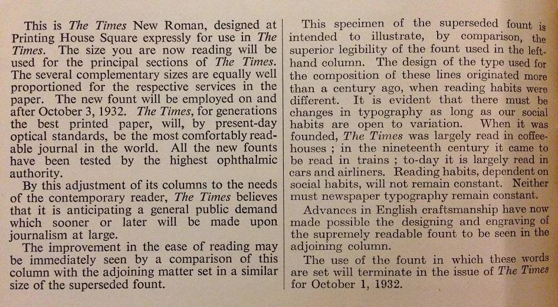

# Tips & Tricks

Here is an assortment of design tips that I've learned and discovered over the
course of my bitmap font journey, which may help you on your own journey.

## Tradeoffs between different font characteristics

The decisions you make when beginning to design your font play a large part in
determining how your font eventually behaves, as well as the kinds of
compromises you'll eventually have to make as you continue designing that font.

### Proportional vs. Monospaced

/// caption
Source: [nypl.org](https://nypl.org)
///

Proportional fonts are suitable for a variety of text use cases. The immediate
benefit of making your font proportional is that you can fit the width to the
glyph, as opposed to the glyph to the width. For example, you can easily make
"m" wider than "x", and "x" wider than "i". This grants you more freedom in
design choices, and makes it far easier to expand your font's Unicode support
without having to compromise compactness.

/// caption
Source: [htop.dev](https://htop.dev)
///

Monospaced fonts tend to be more niche than proportional fonts, and are
primarily used in data-heavy contexts where the fixed glyph width is important.
Terminal emulators, for example, rely on the fixed width to properly display
tabular data and render more complex UI elements. The design choices you can
make with a monospaced font are inherently limited by its width constraint; you'll
have to make "m", "x", and "i" the same width. A significant part of your
design process will involve balancing aesthetics and legibility/readability
through compromises in compactness and spacing.
