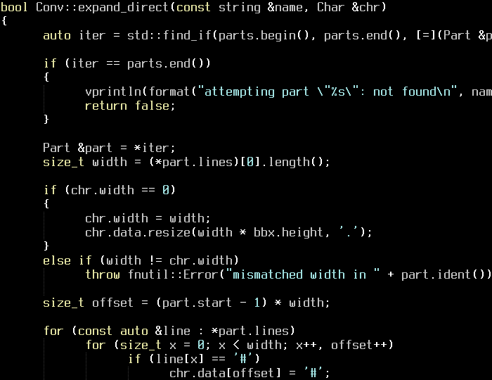

# Tips & Tricks

Here is an assortment of design tips that I've learned and discovered over the
course of my bitmap font journey that may help you on your own journey. Many of
these tips apply not just to bited, but also to bitmap type design in general.

## Tradeoffs between different font characteristics

The decisions you make when beginning to design your font play a large part in
determining how your font eventually behaves, as well as the kinds of
compromises you'll eventually have to make as you continue designing that font.

### Proportional vs. Monospaced

Proportional fonts are suitable for a variety of text use cases. The immediate
benefit of making your font proportional is that you can fit the width to the
glyph, as opposed to the glyph to the width. For example, you can easily make
"m" wider than "x", and "x" wider than "i". This grants you more freedom in
design choices, and makes it far easier to expand your font's Unicode support
without having to compromise compactness.

{loading=lazy}

/// caption
Source: [nypl.org](https://nypl.org)
///

Monospaced fonts tend to be more niche than proportional fonts, and are
primarily used in data-heavy contexts where having a fixed glyph width is
important. Terminal emulators, for example, rely on the fixed width to properly
display tabular data and render more complex UI elements. The design choices you
can make with a monospaced font are inherently limited by its width constraint;
going back to the previous example, you'd have to make "m", "x", and "i" the
same width. A significant part of your design process will involve balancing
aesthetics and legibility through compromises in compactness and spacing.

{loading=lazy}

/// caption
Source: [htop.dev](https://htop.dev)
///

The choice between proportional and monospaced is not entirely black-and-white,
however. A proportional font may have monospaced digits for cleaner numerical
formatting. Conversely, a monospaced font may have proportional widths in its
less-used glyphs for the sake of legibility.

### Size

The overall size of your font's bounding box directly affects how much detail
you can pack into each glyph -- and indirectly, how much Unicode support you can
have. For reference, [GNU Unifont](https://unifoundry.com/unifont/) is 8x16 and
16x16, and features perhaps the most comprehensive Unicode support of any bitmap
font. If you're looking to build a font specifically for HiDPI screens, then
choosing a larger size will afford you much more flexibility to make readable
fonts with great Unicode support while remaining reasonably compact.

{loading=lazy}

/// caption
[Terminus](https://terminus-font.sourceforge.net/) 10x20 Bold. The large size
allows for bold variants and Unicode coverage, even in monospace.
///

There is a **practical** lower limit to the bounding box size. For example, with
only 4px width for the glyph itself, letters like "m" and "w" become quite
difficult to design around. But don't let this discourage you!
[nanofont3x4](https://github.com/Michaelangel007/nanofont3x4) manages to support
the entirety of printable ASCII, and is about as readable as you can get at that
tiny of a size.

{loading=lazy}

/// caption
[eldur](https://github.com/molarmanful/eldur) 5x13. Note how the "m" and "w"
glyphs are drawn to fit into a 4px width.
///

### Width-to-Height Ratio

The effect of width-to-height ratio on your font can be a bit subtle. If you
don't plan on supporting Unicode symbols blocks and box drawings in your font,
then choosing this ratio is largely a matter of aesthetic preference. On the
other hand, if you want your font to support these symbols, then here are a few
considerations to keep in mind:

- **Block elements** (`U+2580..U+259F`) are composed of 8ths. These are easiest
  to draw when your width/height are divisible by 8.
- **Box drawings** (`U+2500..U+257F`) have several types of lines:
    - Normal straight lines. These go through the center of the bounding box, and
      are easiest to draw when the lines can be visually centered. E.g. 1px
      lines go best with odd widths/heights.
    - Bold straight lines. Same deal as their normal counterparts.
    - Dashed variants of normal/bold straight lines. These tend to be subdivided
      in ways that are nightmarish to account for.
    - Diagonal lines that go from corner to corner. Perfectly straight diagonal
      lines are found at `1:n` or `n:1` ratios -- e.g. 8x8, 8x16.

!!! note

    In this case, "easiest to draw" basically implies "looks the best".

With vector fonts, you can design these symbols as-is and pay a relatively small
cost in rendered crispness. But with bitmap fonts, you will have to accept some
tradeoffs in visual perfection no matter what dimensions you choose.
Fortunately, our eyes are quite easy to fool!

{loading=lazy}

/// caption
[ANAKRON](https://github.com/molarmanful/ANAKRON) 8x12. If you look closely, you
may be able to pick out tiny imperfections resulting from the tradeoffs I had to
make.
///

### x-height

When targeting readability at smaller sizes, it's pretty common practice for
designers to increase the x-height of their font. Frankly though, I find that
the choice of x-height is up to personal taste. For example, I personally am
partial towards fonts with lower x-heights.

{loading=lazy}

/// caption
[Cozette](https://github.com/slavfox/Cozette) 6x13. Cozette's x-height isn't
that high, but its uppercase letters are 1px shorter than the tallest lowercase
letters. This makes it feel like a font with high x-height.
///
