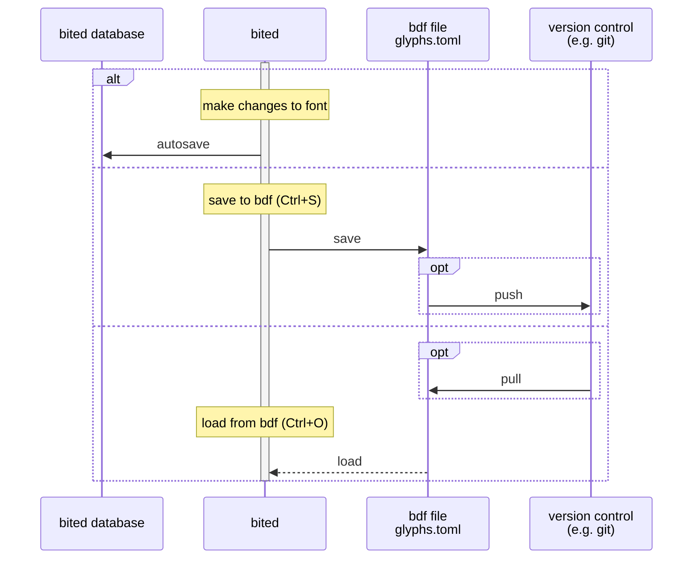

# Save System

## Database

After each change you make to your font, bited autosaves to `saves.db`, a SQLite
database of all the fonts that you loaded into bited. bited also reads from
`saves.db` when loading fonts from the start menu.

???+ question "Location of `saves.db`"

    | OS      | Path                                           |
    | ------- | ---------------------------------------------- |
    | Windows | `%APPDATA%\bited\saves.db`                     |
    | MacOS   | `~/Library/Application Support/bited/saves.db` |
    | Linux   | `~/.local/share/bited/saves.db`                |

## BDF File

Since BDFs are both human-readable and machine-renderable, saving to BDF
(++ctrl+s++) serves both as a backup and an export. BDFs are also very
diff-friendly, so I highly recommend committing your BDF to a version control
system like Git. bited even includes metadata to ensure that bited BDFs are
reproducibly editable across different machines.

To reload a BDF back into bited -- e.g. after pulling from version control or
externally making changes -- simply load from BDF (++ctrl+o++).
