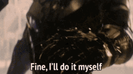

# Why bited?

{loading=lazy}

/// caption

///

**I love bitmap fonts**. Whether it's programming in my terminal of choice or
playing games with pixel art styles, I derive an odd enjoyment from seeing
perfectly crisp pixels on my screen. Bitmap fonts are visually sharp with a
tinge of retro; they're astonishingly readable at small sizes and are great for
fitting more text into small screens.

{loading=lazy}

/// caption

///

When I first began using bitmap fonts for programming, I periodically switched
between fonts made by others. But as someone who is obsessed with customization,
I found myself yearning for a font that was more... bespoke. With my bitmap font
editor of choice -- [Bits'n'Picas](https://github.com/kreativekorp/bitsnpicas)
-- I set to work creating fonts tailored specifically to my personal taste.

{loading=lazy}

/// caption

[eldur](https://github.com/molarmanful/eldur), a stylistically unique font that
is perhaps too tiny for practical use.

///

{loading=lazy}

/// caption

[kirsch](https://github.com/molarmanful/kirsch), another stylistically unique
font I now use as my programming font of choice.

///

As I became more familiar with designing bitmap fonts, I began wishing for
features that weren't present in Bits'n'Picas. I tried
[FontForge](https://fontforge.org), but its unintuitive and clunky UI/UX made
for an uncomfortable time. Other editors, for one reason or another, didn't fit
my desired workflow.

And so I decided to build my own.

{loading=lazy}

/// caption

///
